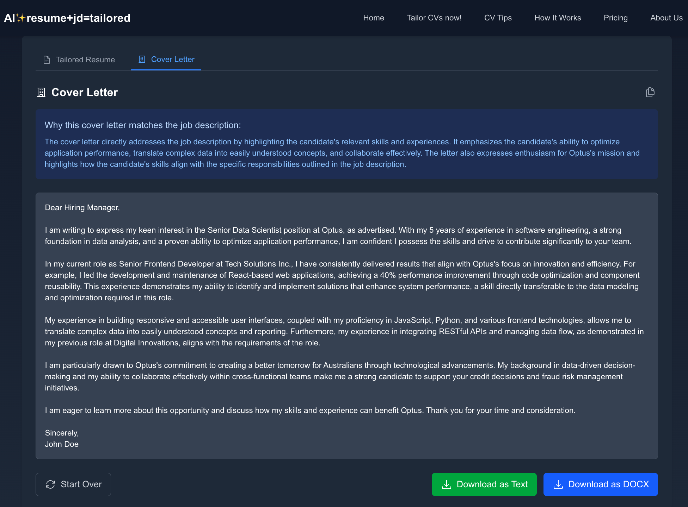
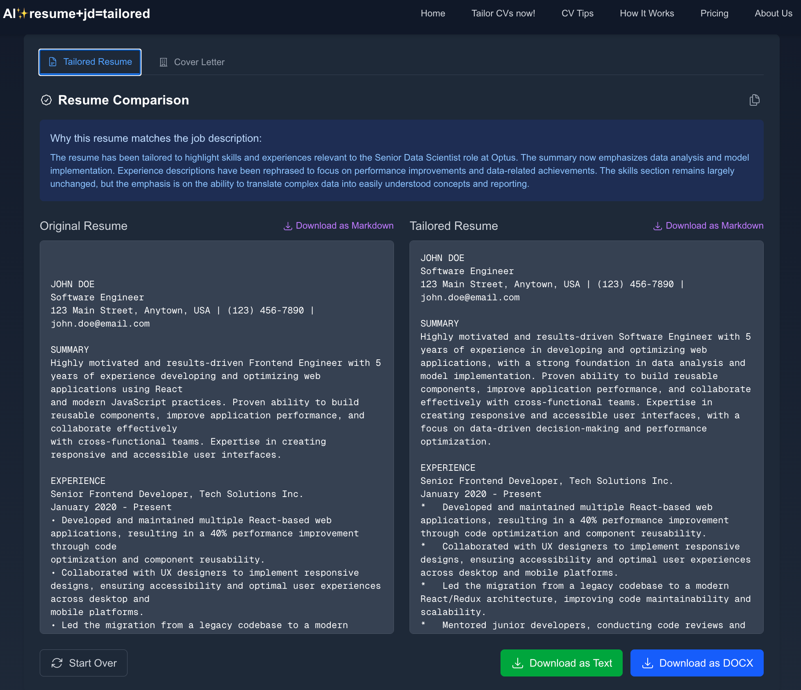
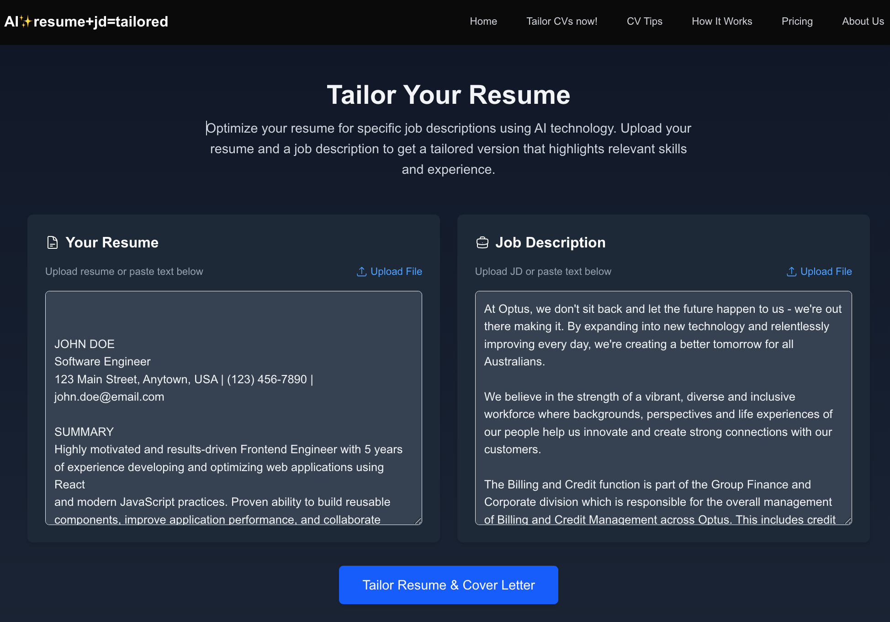

# AI✨resume+jd=tailored

This app helps job seekers tailor their resumes to match specific job descriptions using AI technology. By leveraging Google's Gemini AI, it analyzes both your resume and a job description, then generates a customized version of your resume that highlights relevant skills and experiences.

<p align="center">
  
  
  
</p>

## Live Demo

Try it out: [AI✨resume+jd=tailored on Vercel](https://ai-resume-jd-tailored.vercel.app/)

## Repository

GitHub: [github.com/vuhung16au/ai-resume-jd-tailored](https://github.com/vuhung16au/ai-resume-jd-tailored)

## Features

- **Smart Resume Analysis**: Upload your resume in various formats (PDF, DOCX, TXT, RTF)
- **Job Description Matching**: AI-powered analysis to identify key skills and requirements
- **Multiple Export Formats**: Download your tailored resume as Text or DOCX
- **Side-by-Side Comparison**: Compare your original and tailored resumes
- **One-Click Copying**: Copy the entire tailored resume to clipboard
- **Sample Data**: Try the tool with pre-loaded sample resume and job description

## Getting Started

### Environment Setup

Create a `.env.local` file in the root directory with the following content:

```
GOOGLE_GEMINI_API_KEY=your_gemini_api_key_here
```

You can obtain a Google Gemini API key from the [Google AI Studio](https://ai.google.dev/).

### Running the Application

First, run the development server:

```bash
npm run dev
# or
yarn dev
# or
pnpm dev
# or
bun dev
```

Open [http://localhost:3000](http://localhost:3000) with your browser to see the result.

You can start editing the page by modifying `app/page.tsx`. The page auto-updates as you edit the file.

This project uses [`next/font`](https://nextjs.org/docs/app/building-your-application/optimizing/fonts) to automatically optimize and load [Geist](https://vercel.com/font), a new font family for Vercel.

## Documentation

For more detailed information about this project, please refer to:

- [Installation Guide](./INSTALLATION-GUIDE.md) - Complete setup instructions
- [Features Documentation](./FEATURES.md) - Detailed explanation of all features

## Technology Stack

- **Frontend**: Next.js 14, React, Tailwind CSS
- **AI Integration**: Google Gemini API
- **Document Processing**: PDF parsing, Word document generation
- **File Handling**: Support for PDF, DOCX, TXT, and RTF files

## Privacy & Security

This application processes all data locally in your browser session. No resume or job description data is stored on any server. The Google Gemini API interaction happens server-side with secure API key handling.

## License

This project is licensed under the MIT License - see the LICENSE file for details.

## Acknowledgments

- Google Gemini AI for powering the intelligent resume tailoring
- Next.js and Vercel for the application framework
- All contributors to the open-source libraries used in this project

## Screenshots

<div style="display: flex; justify-content: space-between; margin: 20px 0;">
  <div style="text-align: center; width: 30%;">
    <a href="public/images/generated-cover-letter.png" target="_blank">
      
      <p>Generated Cover Letter</p>
    </a>
  </div>
  <div style="text-align: center; width: 30%;">
    <a href="public/images/tailored-resume.png" target="_blank">
      
      <p>Tailored Resume</p>
    </a>
  </div>
  <div style="text-align: center; width: 30%;">
    <a href="public/images/your-resume-and-jd.png" target="_blank">
      
      <p>Your Resume and JD</p>
    </a>
  </div>
</div>
